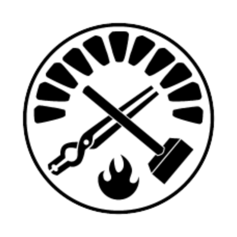

## 👋 Hi there, I'm Kristian!

👾 DeFi Degen | Solidity Developer | Financial Alchemist 💰

Building the future of decentralized finance with code, numbers, and a touch of chaos.

💻 Crafting reliable and efficient smart contracts. 
📊 Bridging traditional finance with blockchain wizardry. 
🚀 Passionate about no-code DeFi tools, protocol security, and sustainable financial ecosystems. 

Smart contracts, smarter decisions. Let's decentralize everything!

### :coffee: Want to build together? Let's connect!

  
  
  

### :hammer_and_wrench: My Tech Stack:

### Languages
<table>
  <tr>
    <td align="center" width="96">
      
       Solidity
    </td>
    <td align="center" width="96">
      
       NodeJS
    </td>
    <td align="center" width="96">
      
       TypeScript
    </td>
    <td align="center" width="96">
      
       JavaScript
    </td>
    <td align="center" width="96">
      
       Python
    </td>
  </tr>
</table>

### Tools
<table>
  <tr>
    <td align="center" width="96">
      
       Foundry
    </td>    
    <td align="center" width="96">
      
       Hardhat
    </td>
    <td align="center" width="96">
      
       VSCode
    </td>
  </tr>
</table>

   
  
<b> :fire: Github Activities:</b>

   

